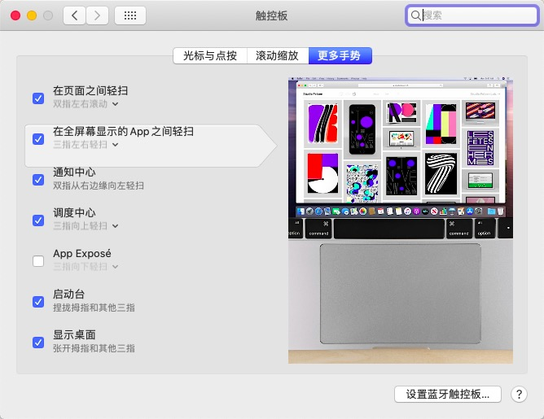

## 我的计算机配置

# 硬件
- <b>型号</b>: Thinkpad T470P
- <b>CPU</b>: i5-7300HQ
- <b>GPU</b>: 集显
- <b>硬盘</b>: 更换为海康e200p
- <b>网卡</b>: 更换为dw1820a
 
## 工作
1. 显卡
2. 无线网卡蓝牙(DW1820A不是特别稳定)
3. 有线网卡
4. 摄像头，触摸板，小红点,键盘，Fn键等
5. 电池状态

## 已知问题
1. 读卡器
2. HDMI没设备测试
3. 指纹
4. AirDrop啥的没有设备测试

## 感谢大佬们的EFI和教程
-  https://github.com/evlon/t470p-oc
-  https://github.com/daliansky/OC-little/
-  https://blog.skk.moe/post/thinkpad-e480-hackintosh-efi/
-  https://github.com/MSzturc/Lenovo-T460-OpenCore

 

